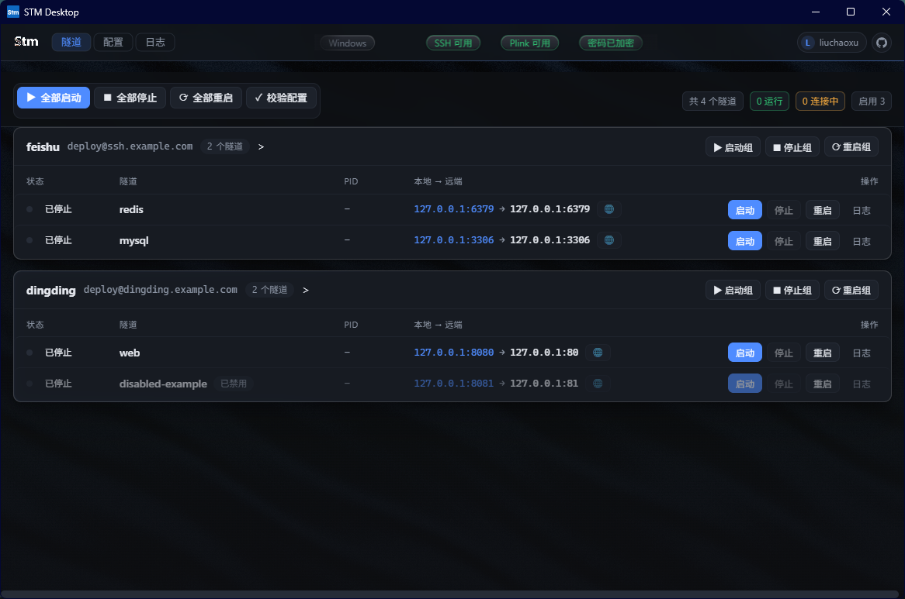
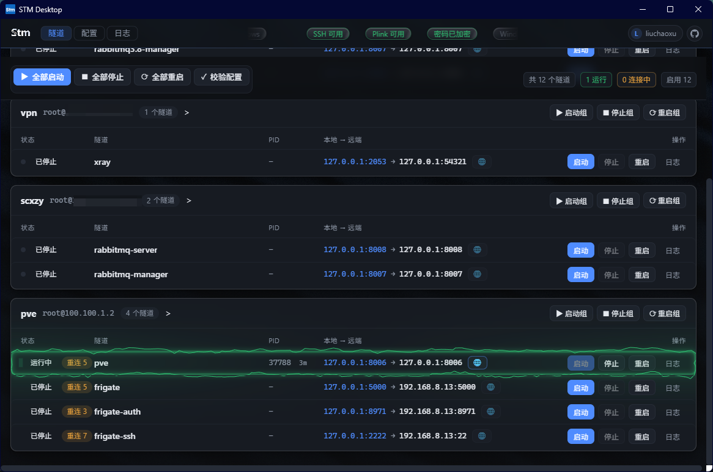
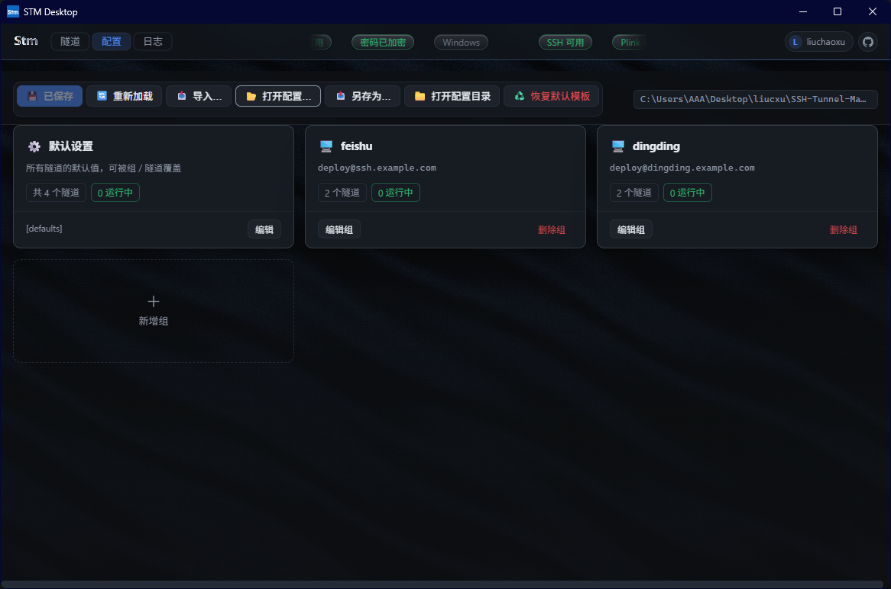
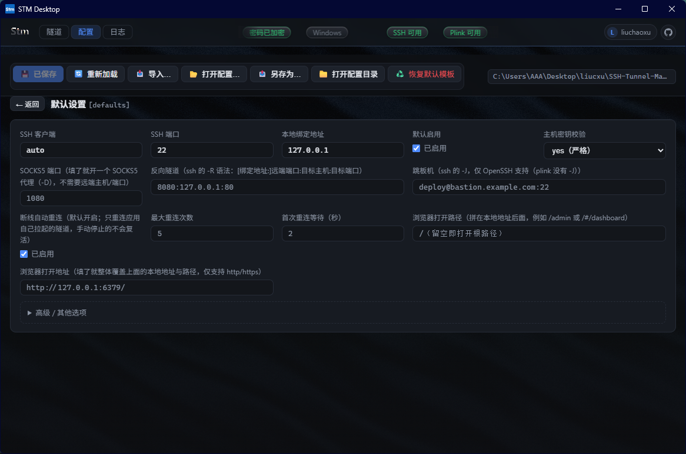
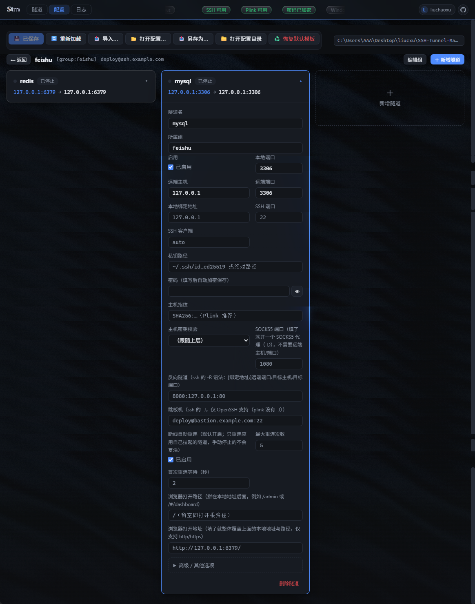
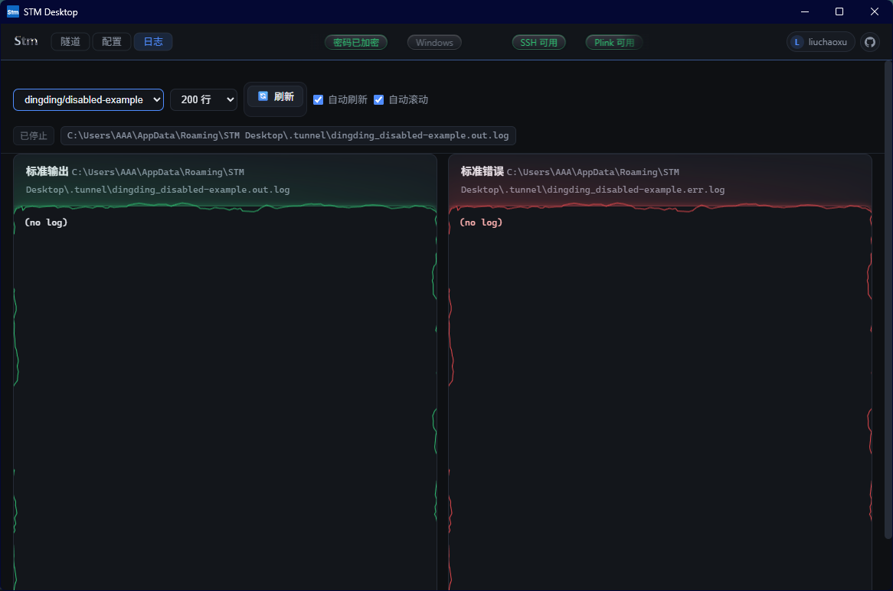

# STM Desktop（SSH 隧道管理器）


基于 **Electron + Vue 3 + TypeScript** 的可视化 SSH 隧道管理工具，将工作区中 [SSH-Tunnel-Manager](../SSH-Tunnel-Manager/README.md)（Python 命令行版）的全部功能移植为桌面 GUI，并把配置管理也做成了页面操作：新增、修改、删除隧道/组、导入导出配置、实时启停与日志查看，无需再手改配置文件。

> STM = SSH Tunnel Manager。项目与打包名称：`STM Desktop`（npm 包名 `stm-desktop`，可执行文件 `STMDesktop.exe`）。

- 支持 Windows / macOS / Linux
- 多组管理：`defaults → 组 → 隧道` 三级配置继承
- 同时支持 OpenSSH 与 PuTTY Plink；Windows 密码认证开箱即用（内置 `plink.exe`）
  
  
  
  
  
  

## 功能特性

| 模块 | 说明 |
| --- | --- |
| 隧道总览 | 按组分卡片展示全部隧道，实时状态（运行中 / 连接中 / 已停止）、PID、本地 → 远端映射 |
| 一键操作 | 启动 / 停止 / 重启，支持单条隧道、整组、全部；`enabled=false` 的隧道在批量启动时自动跳过 |
| 配置校验 | 校验每条隧道并显示脱敏后的完整命令行（密码以 `*` 隐藏） |
| 页面化配置 | 默认设置、组、隧道全部可在页面增删改，支持常用字段快捷添加与任意自定义键值 |
| 配置文件 | 保存即写回磁盘；支持重新加载、打开其它配置、另存为、打开配置目录、恢复默认模板 |
| 日志查看 | stdout / stderr 实时查看，可调行数、自动刷新、自动滚动 |
| 状态提示 | 操作结果 Toast 提示、危险操作二次确认 |

## 技术架构

```
渲染进程 (Vue 3)  ──contextBridge──►  preload: window.api  ──IPC──►  主进程 (Electron / Node)
                                                                    ├─ src/shared/contract.ts 唯一契约：通道名 + 参数/返回类型 + window.api 形状
                                                                    ├─ src/main/ipc.ts        IPC 通道、对话框、路径持久化
                                                                    ├─ src/main/status.ts     状态循环：投影 + 变更推送 + 变更后立即推
                                                                    ├─ src/core/manager.ts    配置生命周期 + 生命周期编排（平台无关）
                                                                    ├─ src/core/config.ts     配置解析/序列化/校验/继承合并
                                                                    └─ src/platforms/node/    桌面传输层：spawn ssh/plink、PID 状态、日志
```

- **共享契约**（`src/shared/contract.ts`）：IPC 通道常量、每个通道的参数与返回类型、`window.api` 的形状，全部只写一遍。preload 实现 `StmApi`、主进程用泛型 `handle()` 注册 handler，两边都对同一张类型表做检查 —— 通道名打错、参数/返回值对不上、少注册一个 handler 都是**编译错误**（渲染侧只保留把契约类型映射成全局别名的 `api.d.ts`）
- **平台无关核心**（`src/core/`）：领域模型、配置解析/序列化/校验/继承合并、生命周期编排（并发锁、批量调度、视图投影），不引用 `fs`/`path`/`net`/`child_process`（由 ESLint 强制），可跑在任何运行时
- **平台实现**（`src/platforms/node/`）：桌面传输层，基于 Node 标准库 spawn 系统 `ssh` 或内置 `plink`，负责 PID 状态文件、端口探测、停止升级与日志轮转，不依赖第三方包。新增平台（Android / iOS）只需实现 `ConfigStore` / `SecretStore` / `TunnelTransport` 三个接口。进程存活判定在 Windows 上用**一次** `tasklist` 全量快照（缓存 900ms）完成，而不是每条隧道一次进程枚举
- **预加载**（`src/preload/`）：通过 `contextBridge` 暴露类型安全的 `window.api`（`tunnel` / `config` / `app`），并订阅主进程推送
- **渲染进程**（`src/renderer/`）：Vue 3 单页界面。隧道状态由**主进程循环推送**（`main/status.ts`：仅在窗口可见时按 2s 投影、内容没变不推送、启停/改配置后立即推），渲染层只订阅，自己留 15s 兜底轮询；样式为 Tailwind v4（**未启用 Preflight**，且工具类位于 `utilities` 层，因此不会覆盖迁移中的存量 CSS）+ 手写 CSS；动效与背景来自 [vue-bits](https://vue-bits.dev) 的组件移植（`components/bits/`），其中 WebGL 部分依赖 `ogl`，Dock 的弹簧依赖 `motion-v`

## 快速开始

环境要求：Node.js 18+（推荐 20+）。

```bash
# 安装依赖（首次）
npm install

# 开发模式（热更新）
npm run dev

# 运行已构建产物
npm start

# 类型检查 + 构建到 out/
npm run build

# 打包安装程序（Windows / macOS / Linux）
npm run build:win
npm run build:mac
npm run build:linux
```

Windows 安装包为 **NSIS 向导式安装**（`dist/stm-desktop-1.0.0-setup.exe`），安装过程中可**选择安装目录**、选择是否创建桌面快捷方式，默认安装到当前用户的程序目录（无需管理员权限）。

## 界面操作指南

顶部工具栏是一块**玻璃板**（半透明 + 背景模糊，背后的丝绸会透出来）：金属 **Stm** 字标、隧道 / 配置 / 日志 三个页签、状态跑马灯、右侧的作者链接（配置文件的路径现在显示在「配置」页顶部，不在工具栏里）。隧道页与配置页的动作按钮行**固定在页面顶部**，长列表里滚动时不会跟着走。

页签是镜面高光按钮（WebGL2）：指针靠近时，按钮边缘会沿圆角泛起一道跟随指针方向的高光；当前页以强调色底 + 强调色文字标示。左上角是金属渲染的 **Stm** 字标。

页签右侧是一条**状态跑马灯**（LogoLoop）：SSH 可用性、Plink 来源、密码是否加密、当前平台（tooltip 里给出 Electron / Node / Chrome 版本）四个**毛玻璃芯片**（半透明 + 模糊 + 不定期扫过的高光）以约 26 px/s 缓慢横向漂移。整条流马灯的宽度**正好等于一份序列**，所以同一条状态不会在屏幕上同时出现两次；**指针移入即暂停**，方便看清某个状态；进行中的批量操作提示不会漂走，它固定在跑马灯左侧。

页面顶部的动作按钮行是一个 **Dock**：指针扫过时，条目按距离用弹簧物理放大（悬停不会改变这一行的高度，因此不会推着页面上下跳）。隧道数 / 运行 / 连接中 / 启用等计数用 3D 挤出文字（DepthText）显示。

**运行中 / 连接中**的隧道行会亮起**电气边框**（沿圆角矩形流动的电流状描边：绿色 = 运行中、琥珀色 = 连接中）；日志页的**标准输出 / 标准错误**两个实时日志框也带同样的边框（绿色 / 红色，刷新中转为蓝色）。

「隧道」与「配置」页带一层缓慢流动的丝绸着色器背景（WebGL）；卡片在鼠标靠近边缘时会亮起边缘光辉。全部动效都尊重系统的「减少动态效果」设置（`prefers-reduced-motion`）。

### 隧道页（默认）

- **全部启动 / 全部停止 / 全部重启**：作用于所有启用的隧道
- **校验配置**：逐条构建命令并校验，绿色“通过”或红色“失败”，失败原因精确定位到具体隧道；通过项可查看脱敏后的完整命令行
- **分组卡片**：每组显示 `服务器@用户名`、隧道数量，以及 启动组 / 停止组 / 重启组
- **隧道行**：状态点（绿=运行中、黄=连接中、灰=已停止）、PID 与已运行时长、`本地地址 → 远端地址`，以及 启动 / 停止 / 重启 / 日志 按钮
  - 状态为“连接中”表示进程已拉起但本地端口尚未打开（SSH 握手 / 主机密钥确认中）
  - 隧道掉线时会**自动重连**（指数退避，默认最多 5 次，健康运行 30 秒后重试预算重置）；重连过的行会显示琥珀色「重连 N」药丸。手动停止的隧道不会被重连复活
  - **SOCKS5 / 反向隧道**也显示在这一列：动态转发的远端显示为 `SOCKS5`，反向隧道显示为 `⇠ 绑定:端口:主机:端口`
  - 地址右边的 **🌐** 按钮在浏览器里打开这条隧道**自己的本地地址**（`local_bind` 是 `0.0.0.0` 这类通配绑定时按 `127.0.0.1` 打开）。默认打开 `http://<本地地址>:<本地端口>/`，可以用隧道 / 组 / 默认设置里的 `web_path` 追加路径，或用 `web_url` 整条覆盖；**只有运行中可用**，鼠标悬停会显示将要打开的地址（停用时说明原因）
- 表格的表头与每一行共用同一组列宽，因此 状态 / 隧道 / PID / 本地 → 远端 / 操作 始终对齐
- 工具栏里的计数（共 N 个隧道 / 运行 / 连接中 / 启用，以及组卡片上的数量）是**滚动计数器**：数字变化时会像里程表一样滚到新值，字号、颜色与字重都跟随所在的文字，不会比旁边那行字更大或更亮

### 配置页

**概览是一张卡片网格**：默认设置一张卡片，每个组各一张卡片。组卡片上直接显示 `用户名@服务器:端口` 与隧道数量 / 运行中数量；**点卡片进入组**，**点卡片上的「编辑组」**打开组信息弹窗（服务器、认证、端口等，含「高级 / 其他选项」）。

- **进入组后**：组内每条隧道都是独立卡片，卡片上显示状态点（运行中 / 连接中 / 已停止）、`本地 → 远端` 与 PID；点卡片就地展开编辑（常用字段表单 + 高级键值编辑器），再点收起 —— 折叠不会丢失未完成的编辑
- **未定义组**：如果隧道引用了不存在的组（例如旧式 `[隧道名]` 段会落在隐式的 `default` 组），会以「未定义」卡片单独列出（这类隧道只继承默认设置），点「创建组配置」即可补上 `[group:…]` 段
- **默认设置**：`[defaults]`，全部隧道的默认值（客户端、SSH 端口、绑定地址、默认启用、主机密钥策略等）
- **组**：`[group:名称]`，组内隧道共享的服务器与认证信息；组名改动时组内隧道自动跟随；删除组时组内隧道保留但不再继承该组配置
- **隧道**：`[tunnel:组:名称]`，必填项为 本地端口 / 远端主机 / 远端端口（另需组的 server/username）；卡片展开后是常用字段表单，其余选项放在「高级 / 其他选项」键值编辑器里
- **文件操作**：重新加载（丢弃未保存修改）、**导入…**（从 OpenSSH `~/.ssh/config`、PuTTY `.reg` 会话导出、mRemoteNG `confCons.xml` 导入——按扩展名与内容自动识别，只增不覆盖，导入的隧道默认停用、端口需要你补全，确认后进入编辑器等待保存）、打开配置…（切换到已有配置文件，如原来的 `tunnel.conf`）、另存为…（不含密码）、打开配置目录（在资源管理器中定位）、恢复默认模板

所有修改先停留在内存中，点 **保存配置**（有未保存修改时按钮高亮并提示）才写回磁盘；校验错误会以红色横幅给出精确原因。

### 日志页

选择隧道后可查看其 stdout / stderr 日志文件尾部，支持 100–1000 行、自动刷新（1.5s）、自动滚动；显示日志文件路径与隧道当前是否在运行。

## 配置说明

### 配置文件位置

- 默认：`<用户数据目录>/tunnel.conf`
  - Windows：`%APPDATA%\STM Desktop\tunnel.conf`
  - macOS：`~/Library/Application Support/STM Desktop/tunnel.conf`
  - Linux：`~/.config/STM Desktop/tunnel.conf`
- 在「配置」页点 **打开配置…** 可切换到其它文件（路径会记录在 `settings.json`，下次启动自动沿用）
- 运行时状态与日志存放于 `<用户数据目录>/.tunnel/`（PID 状态 JSON + `*.out.log` / `*.err.log`）
- 加密后的密码存放于 `<用户数据目录>/secrets.json`（仅在系统有可用凭据库时生成；密文绑定当前系统账户）

### 配置格式

继承顺序：`[defaults]` → `[group:组名]` → `[tunnel:组名:隧道名]`，后一级覆盖前一级；命令目标支持 `all`、`组名`、`组/隧道名`。

```ini
[defaults]
client=auto
server_port=22
local_bind=127.0.0.1
enabled=true
strict_host_key_checking=accept-new

[group:feishu]
server=ssh.example.com
username=deploy
password=replace-with-password        # 密码认证：Windows 自动用 plink，Linux/macOS 用 SSH_ASKPASS
hostkey=SHA256:replace-with-fingerprint  # Plink 建议填写人工核验的主机指纹

[tunnel:feishu:redis]
local_port=6379
remote_host=127.0.0.1
remote_port=6379

[tunnel:feishu:mysql]
enabled=false                          # 批量启动时跳过
local_port=3306
remote_host=127.0.0.1
remote_port=3306
```

旧式 `[隧道名]` 段仍兼容：段内写 `group=组名` 即归入该组，未写则归入 `default` 组。所有键名不区分大小写。

### 字段说明

| 键 | 默认值 | 说明 |
| --- | --- | --- |
| `server` | — | SSH 服务器地址（必填） |
| `username` | — | SSH 用户名（必填） |
| `local_port` | — | 本地监听端口（必填，1–65535） |
| `remote_host` | — | 远端转发目标主机（必填） |
| `remote_port` | — | 远端转发目标端口（必填，1–65535） |
| `client` | `auto` | `auto` / `ssh` / `plink.exe` / `plink` 或自定义路径；`auto` 时 Windows 密码认证优先用内置 plink，其余情况优先系统 OpenSSH |
| `server_port` | `22` | SSH 服务器端口 |
| `local_bind` | `127.0.0.1` | 本地绑定地址（填 `0.0.0.0` 可对外暴露，注意安全） |
| `password` | — | 密码（仅 Plink 或 Linux/macOS AskPass；Windows 下 OpenSSH 不支持密码）。在界面上正常填写即可，保存时会自动移入加密存储 |
| `password_ref` | — | 密码在加密存储中的引用键，由程序自动维护，无需手写 |
| `private_key` | — | 私钥路径：绝对路径 / 相对项目目录 / `~/.ssh/...` |
| `hostkey` | — | SHA256 主机指纹（仅 Plink） |
| `strict_host_key_checking` | `yes` | 仅 OpenSSH：`yes` / `accept-new` / `no`（`no` 不安全） |
| `enabled` | `true` | 为 `false` 时批量启动跳过，但可单独启动/停止/查看日志 |
| `web_path` | `/` | 隧道行 🌐 按钮在本地地址后追加的路径，例如 `/admin`、`/#/dashboard` |
| `web_url` | — | 隧道行 🌐 按钮要打开的完整地址（http/https）；填了就整体覆盖本地地址与 `web_path` |
| `dynamic_port` | — | 填了就开一个 SOCKS5 代理（`ssh -D`），此时不需要 `remote_host`/`remote_port` |
| `remote_forward` | — | 反向隧道（`ssh -R`）：`[绑定地址:]远端端口:目标主机:目标端口`，例如 `8080:127.0.0.1:80` |
| `proxy_jump` | — | 跳板机（`ssh -J`），例如 `deploy@bastion.example.com:22`；**仅 OpenSSH 支持**，plink 没有 `-J`（会明确报错而不是忽略） |
| `auto_restart` | `true` | 掉线自动重连；只会重连应用自己拉起、且用户要求运行的隧道 |
| `restart_limit` | `5` | 连续重连失败上限，用完后保持停止（运行健康 30 秒会重置计数） |
| `restart_delay` | `2` | 首次重连等待秒数，之后逐次翻倍，上限 60 秒 |

> 一条隧道可以**同时**配 `local_port`、`dynamic_port` 与 `remote_forward`：它们是并列的转发，而不是互斥的“模式”，客户端会一次性拿到对应的 `-L`/`-D`/`-R` 标志。

## 实现原理

每个隧道对应一个独立 SSH 客户端子进程，执行 `ssh -N -T -L 本地地址:本地端口:远端地址:远端端口`（Plink 为 `plink -ssh -P … -L … -N -batch`），按需追加 `-D`（SOCKS5）、`-R`（反向隧道）与 `-J`（跳板机）。PID 与日志记录在 `.tunnel/` 下，管理器据此判断状态、停止与重启：

- **启动**：先检查本地端口未被占用 → 拉起进程（Windows 下以分离进程组运行，关闭应用后隧道仍可存活）→ 写入状态文件（含 PID、启动时间与进程标识，用于显示已运行时长并识别 PID 被复用）→ 最多等待 6 秒确认本地端口打开，失败则回滚清理
- **状态**：进程存活 + 本地端口已开 = 运行中；进程存活但端口未开 = 连接中；否则为已停止（并自动清理失效状态文件）
- **自动重连**：客户端**非应用主动停止**的退出会进入重连队列，按 `restart_delay` 起步、逐次翻倍（上限 60s）重试，直到 `restart_limit`；健康运行 30 秒即重置计数。判定"掉线"与"用户停止"的依据在最靠近进程的地方：停止前先给 PID 打标记，只有未标记的退出才算掉线
- **停止**：Windows 终止进程，Linux/macOS 终止整个会话（进程组）；停止会先取消失效的重连定时器
- **密码认证**：Windows 自动选择内置 `resources/plink.exe`（`-pw`）；Linux/macOS 使用 OpenSSH 原生 `SSH_ASKPASS` 机制（密码通过子进程环境变量传递，不写入命令行或脚本文件）
- **常驻**：窗口关闭只是隐藏，应用留在托盘继续值守（托盘菜单可全部启动/停止、切换开机自启、真正退出）；开机自启以 `--hidden` 启动，只拉起隧道不抢焦点。这些偏好记录在 `<用户数据目录>/settings.json`

## 安全设计

- **渲染进程运行在沙箱中**：`sandbox: true` + `contextIsolation: true` + `nodeIntegration: false`，界面只能通过 `window.api` 这条类型化通道与主进程通信（preload 保持零第三方依赖——沙箱里的 `require()` 只能解析 Electron 自身模块）
- **导航与外部链接白名单**：`will-navigate` 只放行应用自身页面（开发时同源、生产时同 bundle 目录），其余一律拦截；外部链接只把 `http:` / `https:` 交给系统浏览器，`file:` 与自定义 scheme 全部拒绝；不创建弹窗、不嵌入 webview、不授予任何权限（摄像头 / 麦克风 / 定位 / 通知等一律拒绝）
- **IPC 入参校验**：主进程对每个通道的入参做结构与规模校验（类型、非空、长度与数量上限），畸形或恶意 payload 在进入核心层之前就被拒绝
- **配置文件路径白名单**：只有通过原生对话框选择的路径（或应用自己持久化到 `settings.json` 的路径）才能被切换为当前配置，避免被诱导读取任意文件
- **密码不进程命令行**：使用随应用分发的 Plink（0.84）时，密码经 `-pwfile` 以 0600 权限暂存、会话结束即删除、下次启动清扫残留；只有版本未知的用户自备 plink 才回退到 `-pw`
- **密码加密存储**：配置文件中只保留 `password_ref`，密文由 Electron `safeStorage`（Windows DPAPI / macOS Keychain / Linux libsecret）加密后存放于 `<用户数据目录>/secrets.json`，界面与隧道进程使用时才在内存中解密；顶栏会显示"密码已加密"。若系统没有可用凭据库（例如 Linux 缺少 libsecret），则**保持明文存储并在顶栏显示"密码明文"**，不会假装加密
- **导出不含密码**：`另存为…` 会剔除密码与密码引用，对话框标题即为"导出配置（不含密码）"

## 测试

```bash
# 1. 类型检查 + 代码规范
npm run typecheck
npm run lint
npm run format        # prettier 自动格式化

# 2. 引擎冒烟测试（无需 Electron，无第三方依赖）
npm run smoke
```

`npm run smoke` 覆盖：真实 `tunnel.conf` 解析与三级继承合并、序列化往返一致性、旧格式段兼容、缺字段/非法端口/重复隧道/重复键等错误场景、目标解析（all/组/精确）、plink 与 OpenSSH 命令构建（含密码脱敏）、完整的 启动→状态→日志→重复启动→停止→重启 生命周期、端口占用冲突、默认模板有效性。

其中**平台无关核心**用一个内存 `ConfigStore` + 内存 `SecretStore` + 内存 `TunnelTransport` 驱动（零进程、零 socket、零文件），覆盖批量启停/重启、按隧道的生命周期锁（并发启动只起一次）、传输失败上抛、端口冲突、日志与校验投影、配置切换失败回滚、**自动重连策略**（掉线重连并计数、用户停止的不复活、`auto_restart=false`、失败消耗预算后不再重试），以及完整的凭据流程（明文注入界面、密文抽取落盘、导出剔除凭据、重命名迁移、清空删除、无凭据库时保持明文）；**桌面传输层**则用真实 spawn 的假 SSH 客户端覆盖进程启停、状态文件清理、停止升级（SIGKILL）、日志轮转与 `-pwfile` 暂存文件生命周期；另有 URL 策略、IPC 入参校验、**共享契约**（通道名唯一且带命名空间、推送通道不与 invoke 通道重名、config 通道齐全）、**转发形态命令构建**（`-D`/`-R`/`-J` 与组合、plink 拒绝 `-J`、非法配置被拒）、**导入解析与合并**（三个格式 + 只增不覆盖 + 合并结果可往返）与 **Windows 进程快照解析**（引号内逗号、脏行、空表）的断言。共 176 项断言。

其中密码加密的"加密 → 落盘 → 解密"往返由端到端检查一并验证。

`npx electron scripts/ipc-check.cjs` 除断言外，还会把各界面状态截图写到 `out/shots/*.png`（隧道页含丝绸背景、配置页、组详情、隧道展开、组信息弹窗、日志页，以及卡片 hover 态与 Dock 放大态），并读回像素统计来判断背景是否真的在渲染与动画。

该脚本还会对**动效本身**取证，前提是窗口可见：它先 `show() + setAlwaysOnTop(true) + focus()` 并打印 `WINDOW {visible,minimized,focused,visibility}`。这一步不可省略 —— Windows 的遮挡检测会把被其他窗口盖住的窗口判为 `hidden`，Chromium 随之节流 `requestAnimationFrame`，于是跑马灯位移、Dock 放大、背景动画全部会量出"没生效"的假象。窗口可见后，脚本读取跑马灯轨道 0.9 秒前后的 `transform`（应位移约 23–24px，对应 26 px/s）、指针移上 Dock 条目前后的 `clientHeight`（26 → 36，同时打印指针下真正命中的元素），以及同页两帧的像素差（`changedPct` 约 26–32%）。

界面动效的取证还包括：跑马灯同屏是否重复（`maxVisibleRepeat`，应为 1）、间距是否真的生效（`gap`，并额外用一个离屏探针元素验证那条工具类本身有没有被 CSS 层序吃掉）、毛玻璃是否生效（`backdropFilter`，前缀与标准写法都读）、每个界面上电气边框的宿主数量与画布上**实际描边的墨迹像素数**（`ink`）、**表格列对齐**（`align.deltas`：表头行与每个数据行同一单元格的左边缘差，应全为 0）、**每行的 🌐 打开按钮**（`webButtons` 的禁用态与 tooltip 里的地址，必须与 `runningRows` 一致），以及**计数器滚动**（`COUNTER ROLL`：数字轮偏离窗口中心的 `lift` > 1，说明确实在滚而不是瞬间跳值）。

隧道行的电气边框需要“运行中 / 连接中”才点亮，而启动真实隧道会真的去连用户的服务器，所以脚本改为伪造应用自己的状态判据：往运行时目录写一个 `pid` 指向探针自身、端口从未监听的状态文件，等主进程状态循环（2s）算出状态后取证（此时行边框点亮、计数从 0 滚到 1），随后立刻删除该文件（截图 `out/shots/11-row-electric-border.png`）。这一窗口（3.6s）比渲染侧的兜底轮询（15s）短，所以它还顺带证明了状态是**主进程推过来的**（`pushes` 计数 + UI 在同一窗口内变化）。

端到端 IPC 检查（可选，需先 `npm run build`）：

```bash
npx electron scripts/ipc-check.cjs
```

该脚本启动构建产物，并从渲染进程实际调用 `window.api` 的各通道，验证 preload 桥接与主进程 IPC 处理器。注意：它以 `electron scripts/ipc-check.cjs` 方式启动时应用根目录会解析到 `scripts/`，因此输出中的 `plink:false` 属正常现象（正式 `npm run dev/start` 或打包运行时会正确识别 `resources/plink.exe`）。

## 目录结构

```
STM Desktop/
├─ src/
│  ├─ core/                     # 平台无关领域层（禁止引用 fs/net/child_process/electron）
│  │  ├─ types.ts               # 领域模型（配置/隧道/视图/错误）
│  │  ├─ config.ts              # 配置解析/序列化/校验/三级继承合并
│  │  ├─ storage.ts             # ConfigStore / SecretStore 接口
│  │  ├─ transport.ts           # TunnelTransport 接口（唯一与平台耦合的能力）
│  │  └─ manager.ts             # 配置生命周期 + 生命周期编排（锁/并发/视图投影）
│  ├─ shared/
│  │  └─ contract.ts            # 唯一契约：IPC 通道常量 + 参数/返回类型 + window.api 形状
│  ├─ core/
│  │  ├─ importers.ts           # 导入解析器：OpenSSH / PuTTY .reg / mRemoteNG（纯函数）
│  │  └─ import-merge.ts        # 导入合并策略：只增不覆盖
│  ├─ platforms/
│  │  └─ node/                  # 桌面实现
│  │     ├─ config-store.ts     # FileConfigStore（原子写）
│  │     ├─ exec-transport.ts   # spawn ssh/plink、PID 状态、端口探测、日志轮转、进程快照
│  │     ├─ tail-file.ts        # 多字节安全的分块尾部读取
│  │     └─ index.ts            # createTunnelManager 装配
│  ├─ main/                     # Electron 壳
│  │  ├─ index.ts               # 应用入口：创建窗口、注册 IPC、启停状态循环与托盘
│  │  ├─ ipc.ts                 # IPC 通道、对话框、路径持久化（契约类型化 handler）
│  │  ├─ status.ts              # 状态循环：自动重连 + 投影 + 变更推送（仅窗口可见时运行）
│  │  ├─ tray.ts                # 托盘、关窗隐藏、开机自启
│  │  ├─ settings.ts            # 外壳自己的 settings.json（配置路径 / 自启 / 关窗行为）
│  │  ├─ config-import.ts       # 选文件、识别格式、确认、返回合并后的草稿
│  │  ├─ security.ts            # 导航/弹窗/权限加固 + openExternal 白名单
│  │  └─ secret-store.ts        # safeStorage → secrets.json
│  ├─ preload/
│  │  ├─ index.ts               # contextBridge 暴露 window.api（实现 StmApi + 订阅推送）
│  │  └─ api.d.ts               # 把契约类型映射成渲染侧的全局别名
│  └─ renderer/
│     └─ src/
│        ├─ App.vue             # 布局：头部/页签/视图切换
│        ├─ views/              # TunnelsView / ConfigView / LogsView
│        ├─ components/         # KeyValueEditor / ToastHost
│        │  ├─ bits/            # 动效与背景件：SpecularButton / Dock(+DockItem) / MetallicPaint / Silk / BorderGlow / LogoLoop / ElectricBorder / Counter(+CounterDigit) / AnimatedContent / RevealPanel
│        │  │                    # 未使用（保留备查）：GooeyNav / SpotlightCard / ShinyText / CountUp / DepthText
│        │  └─ config/          # 配置页卡片：SummaryCard / TunnelCard / OptionsEditor / GroupEditorModal
│        ├─ composables/        # 状态订阅（主进程推送）+ 兜底轮询、Toast、页签共享状态
│        └─ assets/main.css     # 深色主题样式 + 动效
├─ scripts/
│  ├─ tunnel-smoke.ts           # 引擎冒烟测试（npm run smoke）
│  └─ ipc-check.cjs             # 端到端 IPC 检查
├─ resources/
│  ├─ plink.exe                 # PuTTY Plink 0.84（Windows 密码认证）
│  └─ PUTTY-LICENSE.txt         # PuTTY 许可证
├─ electron-builder.yml         # 打包配置（extraResources 携带 plink）
└─ package.json
```

## 常见问题

- **Windows 密码认证报错“use client=plink.exe for password authentication on Windows”**：OpenSSH 在 Windows 上不支持命令行密码，请改用密码认证时在组/隧道设置 `client=plink.exe`（或保持 `auto`，应用会自动使用内置 plink）。
- **首次连接提示主机密钥**：建议先运行一次 `ssh user@server` 核验并保存主机密钥；OpenSSH 可设 `strict_host_key_checking=accept-new`，Plink 建议在 `hostkey` 中填写人工核验的 SHA256 指纹。
- **关闭应用后隧道还在运行**：隧道以分离进程运行，这是有意为之（与命令行版一致），重新打开应用可继续管理。
- **配置文件权限**：启用密码加密后 `tunnel.conf` 不再包含明文密码，但仍建议限制为当前用户可读写（Linux/macOS：`chmod 600 tunnel.conf`）。`secrets.json` 中的密文只能在当前系统账户下解密，拷到其它机器或账户会失效，需要重新填写密码。
- **打包**：`npm run build:win` 会调用 electron-builder 下载打包工具，`.npmrc` 已配置国内镜像；NSIS 安装器已开启“选择安装目录”（`electron-builder.yml` 中 `oneClick: false` + `allowToChangeInstallationDirectory: true`）。离线环境可跳过打包，直接使用 `out/` 产物或 `npm run dev`。

## 许可证与第三方组件

- 本项目的隧道管理逻辑移植自[SSH-Tunnel-Manager](https://github.com/liuchaoxu/SSH-Tunnel-Manager)（GNU GPL v3），分发本项目时请遵守 GPL v3 或取得原项目授权
- 随附的 `resources/plink.exe` 来自 PuTTY 0.84，按 PuTTY 的 MIT 风格许可证发布，重新分发时请保留 `resources/PUTTY-LICENSE.txt` 中的版权声明；PuTTY 上游：<https://www.chiark.greenend.org.uk/~sgtatham/putty/>
